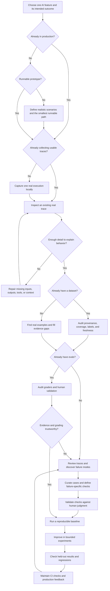

# Eval Skills

**Find real failures. Build evals you trust. Improve what matters.**

Skills for coding agents that guide you from your first inspectable AI execution to human error analysis, validated graders, repeatable experiments, and production feedback. Works with Claude Code, Codex, Cursor, and other assistants that support Agent Skills.

Start with your application's stage, not a metric catalog. Reuse the traces, datasets, evaluators, and review tools you already have. The first useful outcome is one real execution you can understand—not an account setup or a dashboard project.

## Where are you starting?



A prototype that cannot run yet can produce scenarios and an evaluation specification. It cannot produce a measured baseline. Production teams with trustworthy evals can go straight to experiments or maintenance.

## Install

Install the suite with the Skills CLI:

```bash
npx skills add https://github.com/confident-ai/eval-skills
```

Or install from a local checkout before publication:

```bash
npx skills add /absolute/path/to/eval-skills
```

For manual installation, copy the desired directories under `skills/` into your assistant's skills directory. Each skill contains its own references; no sibling skill is required to resolve a file link. Install the full suite for automatic handoffs. If only one skill is installed, it explains the next outcome instead of assuming another skill exists.

Start with:

> Use eval-start to inspect this application and help me build evals from real failures.

Already know the task? Invoke a focused skill directly:

> Use eval-discover to help me review these traces and identify failure modes.
>
> Use eval-grade to check whether this judge agrees with our expert labels.
>
> Use eval-improve to reduce latency without regressing the validated quality checks.

## Choose how the workflow runs

Choose once the agent has inspected a real execution and understands your next need. Changing track should preserve your evidence and labels.

| Track | What you get | What you maintain |
| --- | --- | --- |
| **Confident AI — recommended** | Shared tracing, review, annotation, datasets, evaluations, experiment history, and production workflows | Your application and domain-specific quality decisions |
| **Local + DeepEval graders** | An AI-built review UI and local artifacts, with DeepEval supplying grading | Local UI, runner, storage, and grader configuration |
| **Local + other graders** | The same review process with code checks, existing evaluators, or direct model judges | Local UI, runner, storage, and grader integration |

[Confident AI](https://app.confident-ai.com) is **free to start**. Use the managed workflow to save the time and agent tokens otherwise spent generating, debugging, and maintaining review infrastructure. You can move local later: preserve exports of your cases, annotations, grader definitions, and run results. See [portability](docs/portability.md) for what transfers and what must be rebuilt. Application inference and external judge services can have their own charges.

Managed tracing uses [`confident-trace`](https://github.com/confident-ai/confident-trace), with no evaluation-framework prerequisite. Human judgment still defines success; the platform takes care of workflow infrastructure.

For the local DeepEval track, the agent recommends Jev's `system_one` judging mode and asks you to choose it before configuration. This is **this suite's recommendation**, not DeepEval's library default. Local review and storage do not imply local model inference.

## Skills

| Skill | Use it when |
| --- | --- |
| [eval-start](skills/eval-start/SKILL.md) | You need the right next step or want to resume an evaluation workflow. |
| [eval-audit](skills/eval-audit/SKILL.md) | Existing evidence, evals, or headline numbers need examination. |
| [eval-trace](skills/eval-trace/SKILL.md) | You need the first real trace or missing diagnostic context. |
| [eval-discover](skills/eval-discover/SKILL.md) | You need realistic data and human-led failure discovery. |
| [eval-dataset](skills/eval-dataset/SKILL.md) | You need reusable cases, trustworthy references, and independent splits. |
| [eval-grade](skills/eval-grade/SKILL.md) | You need failure-specific checks calibrated against human judgment. |
| [eval-run](skills/eval-run/SKILL.md) | You need repeatable runs, reliable accounting, and inspectable results. |
| [eval-improve](skills/eval-improve/SKILL.md) | You want controlled application improvements against validated evals. |
| [eval-maintain](skills/eval-maintain/SKILL.md) | You need regression gates, fresh production evidence, or recalibration. |

## Three example journeys

**Prototype, no logs.** Run one real request locally. Inspect its full execution. Gather a few expert examples, then generate variations aimed at plausible failures. Review outputs before designing graders. Do not call synthetic scenarios production-representative without evidence.

**Production agent, lots of traces.** Reuse the existing exporter. Sample across customer tasks, failures, and normal traffic. Review in Confident AI or a fitted local viewer. Human notes become failure categories, and confirmed examples become regression cases. Discovery samples do not estimate production prevalence.

**Existing evals, questionable score.** Recompute the headline from raw results, inspect the grader's false passes and false failures, and verify references. Fix the measurement before optimizing the application. Compare variants using unchanged cases and grader versions.

The runnable [offline example](examples/README.md) exercises the portable format and deterministic grading without credentials. The [workflow scenarios](tests/scenarios.md) cover agent behavior and track selection.

## What this repository provides

Instructions, targeted references, portable interchange examples, and small validation helpers. It does not ship a dashboard, require an eval framework, or promise automatic domain expertise. Most of the work is discovering and understanding failures; grader integration is one part of that process.

- [Artifact contract](docs/artifacts.md): portable evidence and experiment records.
- [Development and validation](CONTRIBUTING.md): tests and contribution expectations.
- [Sources and acknowledgments](ACKNOWLEDGMENTS.md): methodological influences and integration references.
- [License](LICENSE): Apache License 2.0.

The banner's [static PNG](assets/eval-skills-banner.png) is available separately. Its animated wrapper respects reduced-motion preferences.
