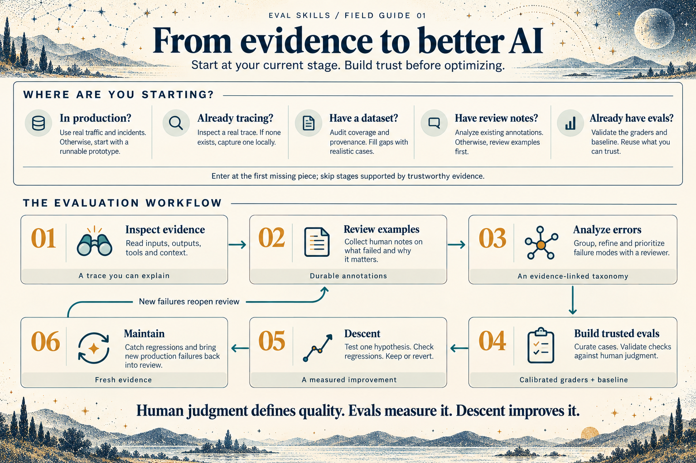
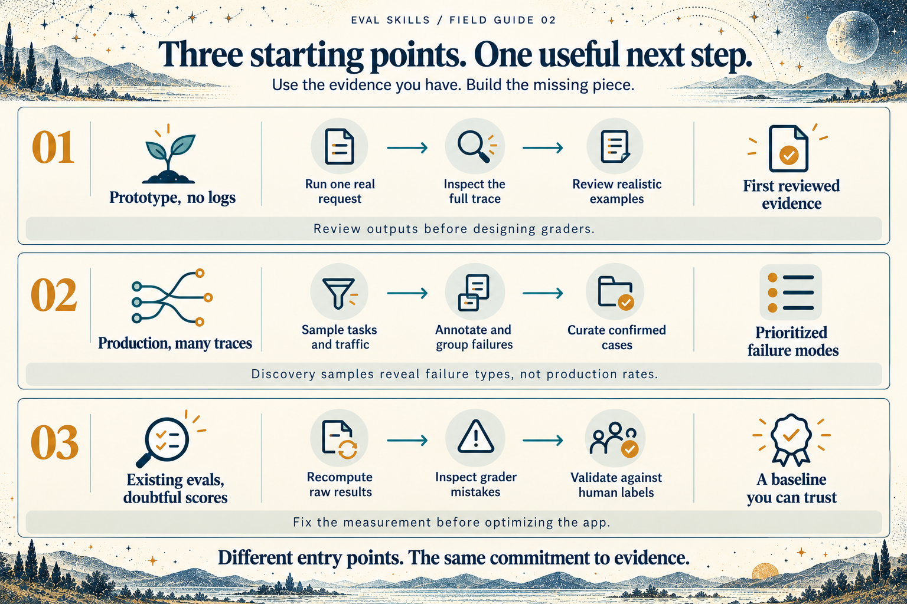

# Eval Skills

**Find real failures. Build evals you trust. Improve what matters.**

Skills for coding agents that guide you from your first inspectable AI execution to human error analysis, validated graders, repeatable experiments, and production feedback. Works with Claude Code, Codex, Cursor, and other assistants that support Agent Skills.

Start with your application's stage, not a metric catalog. Reuse the traces, datasets, evaluators, and review tools you already have. The first useful outcome is one real execution you can understand—not an account setup or a dashboard project.

> [!NOTE]
> This guide defaults to **Jev** for supported model-based graders in the **local, managed graders** route. The agent confirms your judging-mode preference before setup. You can choose another judge or bring your own; see the [judging setup](skills/eval-grade/references/deepeval.md).

## Who this is for

- **Product managers and domain experts** reviewing real examples and defining what good behavior means for users.
- **Engineers** debugging failures, comparing changes, and adding regression checks to production apps.
- **Solo builders and founders** turning an AI prototype into something they can test and improve.
- **Teams building AI products** bringing shared review, trusted graders, and repeatable experiments into their workflow.

Use these skills with a coding agent. Bring your existing traces, datasets, and evals, or start with one real execution.

**Not for:** training foundation models, running general model leaderboards, or getting a universal quality score without reviewing application behavior. The workflow needs someone who can judge what a good outcome means for the product; an agent can organize the evidence and implement checks, but cannot supply that judgment for you.

## The eval workflow

Designed for an individual quickstart, this workflow also scales to team review and shared eval work through the [fully managed route below](#choose-how-the-workflow-runs). Start with one AI feature and enter at the first missing piece. Reuse trustworthy evidence instead of repeating completed stages.

- **Inspect evidence:** check what you already have—production traffic, traces, datasets, and evals. Capture one real execution if needed, and make its behavior understandable.
- **Review examples:** sample realistic cases and record human observations about what failed and why it matters.
- **Analyze errors:** group annotations into failure modes, refine them with a reviewer, and prioritize problems using their frequency and impact.
- **Build trusted evals:** curate reusable cases, validate graders against human judgment, and establish a reproducible baseline.
- **Run Descent:** test one improvement hypothesis at a time, check for regressions, and keep or revert the change based on evidence.
- **Maintain:** catch regressions and feed new production failures back into review.

[](assets/eval-workflow-poster.png)

[Open the full-size poster](assets/eval-workflow-poster.png) · [Read the text version](docs/workflow-poster.md)

A prototype that cannot run yet can produce scenarios and an eval specification. It cannot produce a measured baseline. Production teams with trustworthy evals can go straight to experiments or maintenance.

## Install

Install the suite with the Skills CLI:

```bash
npx skills add https://github.com/confident-ai/codex-eval-skills
```

Or install from a local checkout before publication:

```bash
npx skills add /absolute/path/to/eval-skills
```

For manual installation, copy the desired directories under `skills/` into your assistant's skills directory. Each skill contains its own references; no sibling skill is required to resolve a file link. Install the full suite for automatic handoffs. If only one skill is installed, it explains the next outcome instead of assuming another skill exists.

Start with:

> Use eval-start to inspect this application and help me build evals from real failures.

Already know the task? Invoke a focused skill directly:

> Use eval-discover to help me review these traces and identify failure modes.
>
> Use eval-error-analysis to group our review notes into failure modes and prioritize them.
>
> Use eval-grade to check whether this judge agrees with our expert labels.
>
> Use eval-descent to reduce latency without regressing the validated quality checks.

## Skills

| Skill | Use it when |
| --- | --- |
| [eval-start](skills/eval-start/SKILL.md) | You need the right next step or want to resume an evaluation workflow. |
| [eval-audit](skills/eval-audit/SKILL.md) | Existing evidence, evals, or headline numbers need examination. |
| [eval-trace](skills/eval-trace/SKILL.md) | You need the first real trace or missing diagnostic context. |
| [eval-discover](skills/eval-discover/SKILL.md) | You need realistic data and human-led failure discovery. |
| [eval-error-analysis](skills/eval-error-analysis/SKILL.md) | You have annotations to cluster into reviewed failure modes and priorities. |
| [eval-dataset](skills/eval-dataset/SKILL.md) | You need reusable cases, trustworthy references, and independent splits. |
| [eval-grade](skills/eval-grade/SKILL.md) | You need failure-specific checks calibrated against human judgment. |
| [eval-run](skills/eval-run/SKILL.md) | You need repeatable runs, reliable accounting, and inspectable results. |
| [eval-descent](skills/eval-descent/SKILL.md) | You want controlled application improvements against validated evals. |
| [eval-maintain](skills/eval-maintain/SKILL.md) | You need regression gates, fresh production evidence, or recalibration. |

**Descent** is our bounded improvement loop: choose an evidence-backed hypothesis, test a change, check regressions, and keep or revert it. The name describes reducing failures; the process does not require gradients.

## Three example journeys

[](assets/eval-journeys-poster.png)

[Open the full-size journeys poster](assets/eval-journeys-poster.png). Each journey is described below.

**Prototype, no logs.** Run one real request locally. Inspect its full execution. Gather a few expert examples, then generate variations aimed at plausible failures. Review outputs before designing graders. Do not call synthetic scenarios production-representative without evidence.

**Production agent, lots of traces.** Reuse the existing exporter. Sample across customer tasks, failures, and normal traffic. Review in a shared workspace or a fitted local viewer. Human notes become failure categories, and confirmed examples become regression cases. Discovery samples do not estimate production prevalence.

**Existing evals, questionable score.** Recompute the headline from raw results, inspect the grader's false passes and false failures, and verify references. Fix the measurement before optimizing the application. Compare variants using unchanged cases and grader versions.

The runnable [offline example](examples/README.md) exercises the portable format and deterministic grading without credentials. The [workflow scenarios](tests/scenarios.md) cover agent behavior and track selection.

## Choose how the workflow runs

The same process works across three setups. Choose after inspecting a real execution and identifying what you need next.

| Track | What you get | What you maintain |
| --- | --- | --- |
| **Fully managed** | Shared tracing, review, annotation, datasets, and experiment history through [Confident AI](skills/eval-start/references/managed.md), saving agent tokens on custom tooling and making evals simpler to run | Your application and domain-specific quality decisions |
| **Local, managed graders** | An AI-built review UI and local artifacts, with ready-made graders from [DeepEval](skills/eval-grade/references/deepeval.md) | Local UI, runner, storage, and grader configuration |
| **Fully local, build from scratch** | An AI-built review UI, code checks, and custom or existing judges | Local UI, runner, storage, and graders |

Setup instructions and judging-mode choices live in the skills. Local refers to review, storage, and orchestration; model-based graders can still call external services. Preserve your cases, annotations, and results so you can [change setups later](docs/portability.md).

## What this repository provides

Instructions, targeted references, portable interchange examples, and small validation helpers. It does not ship a dashboard, require an eval framework, or promise automatic domain expertise. Most of the work is discovering and understanding failures; grader integration is one part of that process.

- [Artifact contract](docs/artifacts.md): portable evidence and experiment records.
- [Development and validation](CONTRIBUTING.md): tests and contribution expectations.
- [Sources and acknowledgments](ACKNOWLEDGMENTS.md): methodological influences and integration references.

The banner's [static PNG](assets/eval-skills-banner.png) is available separately. Its animated wrapper respects reduced-motion preferences.

## License

Licensed under the [Apache License 2.0](LICENSE). See [NOTICE](NOTICE) for attribution information.
